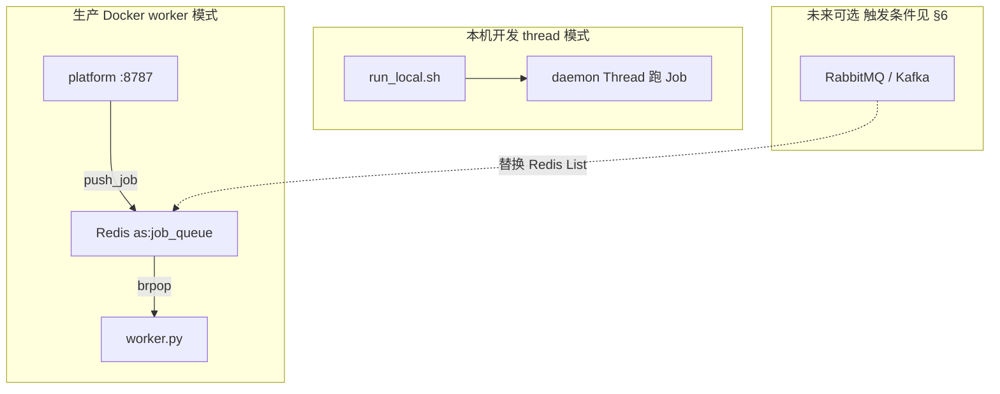
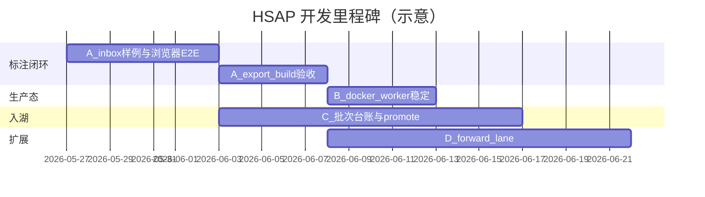

# HSAP 开发计划（2026 Q2）

本文是 HSAP（Huaxu Sentinel Active Safety Platform）的**分期开发路线图**，与现有文档对齐：

- 标注验收：[PHASE_ROLLOUT_DMS.md](./PHASE_ROLLOUT_DMS.md)
- 送标 SOP：[LABELING_SOP.md](./LABELING_SOP.md)
- 缺口跟踪：[QA_GAP_REPORT.md](./QA_GAP_REPORT.md)、[DATA_LAKE_GAP.md](./DATA_LAKE_GAP.md)
- 本地开发：[DEVELOPMENT_GUIDE.md](./DEVELOPMENT_GUIDE.md)

---

## 1. 架构原则（维持当前技术栈）

**结论：现阶段不引入 RabbitMQ / Kafka；DB + thread/worker + Redis 足够。**

| 层级 | 选型 | 用途 |
|------|------|------|
| API | FastAPI + Label Studio Editor 壳 | 送标 / 标注 / 审核 / 训练 / 车队 |
| 持久化 | PostgreSQL（生产）/ SQLite（本机） | Job、Campaign、用户、审批 |
| 异步 Job | `thread`（本机）/ `worker`（Docker） | 导出、build、训练、入湖分析 |
| Redis | List 队列 + Pub/Sub + 标注锁 | 仅 worker 模式强依赖；本机可跳过 |
| 训练/数据 | `as.py` + DMS/Lane registry | inbox → pack → train |



**环境对照**

| 场景 | 启动方式 | Job 执行 | Redis |
|------|----------|----------|-------|
| 本机快速开发 | `bash scripts/run_local.sh` | 进程内 thread | 可选（锁回退 memory） |
| 联调 / 演示 | `docker compose up -d platform worker redis postgres` | 独立 worker | 必须 |
| 训练机 | 仅 `worker.py` + Redis | GPU 节点消费队列 | 必须 |

---

## 2. 阶段总览

| 阶段 | 时间盒 | 目标 | 退出标准 |
|------|--------|------|----------|
| **A** 标注闭环 | 1～2 周 | dam/addw/addw_face 画布→导出→入库可 E2E | P0+P1 清单全绿 |
| **B** 生产运行态 | 1 周 | Docker worker + Redis 稳定跑导出/训练 Job | smoke + Jobs 页成功 |
| **C** 数据入湖 | 2 周 | 批次台账、飞书、MinIO 主路径打通 | DATA_LAKE checklist A～E |
| **D** 扩展任务 | 2～3 周 | forward / lane 画布 + 导出 | P2 清单 |
| **E** 体验与治理 | 持续 | 关键点 UX、审计、权限、文档 | 标注员可独立操作 |
| **F** 架构演进 | 按需 | MQ / 多 worker / 监控 | 见 §6 触发条件 |

---

## 3. 阶段 A：标注闭环（当前最高优先级）

### A.1 已完成（代码侧）

- [x] `dms_pose.xml`（face + 37 关键点）
- [x] `export_ls_to_yolo.py`（detect 5 字段 / pose 116 字段）
- [x] `runner.py` 导出前转换 + `as.py build`
- [x] `batch_stage.py` 有 txt 才设 `returned`
- [x] `test_export_ls_to_yolo.py` 单元测试
- [x] `run_local.sh` / `wait_for_db.py` thread 模式跳过 Redis 等待

### A.2 待完成（验收）

| # | 任务 | 负责人建议 | 验收 |
|---|------|------------|------|
| A2.1 | inbox 放入样例图（dam/addw_face 各 ≥3 张） | 数据/协调员 | `GET .../tasks` 非空 |
| A2.2 | 浏览器：dam 检测框标注保存 | 标注员 | `labels/ls_annotations/*.json` |
| A2.3 | 浏览器：addw_face 框 + 关键点保存 | 标注员 | JSON 含 `rectanglelabels` + `keypointlabels` |
| A2.4 | 导出 Job → `labels/train/*.txt` | 协调员 | dam 5 字段；addw_face 116 字段 |
| A2.5 | 提交入库审核 → build 进 pack | 工程师 | 数据目录可见新 sources |
| A2.6 | 审核预览叠加框 + 关键点 | 审核员 | preview 缩略图正确 |
| A2.7 | 更新 QA_GAP（export 已对接） | 开发 | 文档与代码一致 |

**命令**

```bash
# 离线
python3 /home/chengfanglu/DATA/HSAP/datasets/dms/scripts/test_export_ls_to_yolo.py

# 本机平台
cd /home/chengfanglu/DATA/HSAP && bash scripts/run_local.sh

# API 冒烟（平台起来后）
bash /home/chengfanglu/DATA/HSAP/scripts/smoke_labeling_api.sh
```

### A.3 addw_face 专项增强（可选，A 通过后）

| 任务 | 说明 |
|------|------|
| 关键点语义名 | 在 `addw_face_37.yaml` 补 `display_name`（若有外协规范） |
| 标注进度 | 进度 API 增加「已标 kpt 数/37」 |
| 多脸策略 | 文档化 bbox-关键点分配规则；必要时 UI 约束单脸 |

---

## 4. 阶段 B：生产运行态（worker + Redis）

### B.1 基础设施

```bash
cd /home/chengfanglu/DATA/HSAP
docker compose up -d postgres redis platform worker
# .env: AS_REDIS_PORT=6380 → run_local 已自动对齐
```

| 任务 | 说明 |
|------|------|
| B1.1 | 确认 `AS_JOB_EXECUTOR=worker` 在 compose 内生效 |
| B1.2 | 导出/训练 Job 仅 worker 消费，platform 不阻塞 |
| B1.3 | `/api/v1/health` 中 `redis_connected=true` |
| B1.4 | 标注锁走 Redis（多标注员并行时不抢标） |

### B.2 可观测性（轻量）

| 任务 | 说明 |
|------|------|
| B2.1 | Jobs 页：failed Job 展示 `export_convert` / stderr 摘要 |
| B2.2 | `manifests/trace_log.jsonl` 关键 span 文档化 |
| B2.3 | worker 日志：`执行 Job job-xxx` 与 platform 对齐 |

### B.3 本机 vs Docker 文档

在 [DEVELOPMENT_GUIDE.md](./DEVELOPMENT_GUIDE.md) 增加一节：

- 日常改代码 → `run_local.sh`（thread，无 Redis）
- 验证导出/训练链路 → `docker compose up worker`
- 禁止混用：thread 模式提交的 Job 不会被 Docker worker 消费（同一 Redis 时可消费，但 DB 需一致）

---

## 5. 阶段 C～E：数据入湖与任务扩展

### C. 数据入湖（见 DATA_LAKE_GAP.md）

- 批次台账 → 审批入湖 → inbox 出现在送标工作台
- 飞书多维表格同步（可选，`FEISHU_BITABLE_SYNC_ENABLED=0` 可关）
- MinIO staging（`docker compose --profile minio up`）
- 上传 ZIP → 分析 → promote inbox

### D. forward / lane（P2）

| 任务 | 文件/动作 |
|------|-----------|
| `forward_4cls.xml` / `forward_cls.xml` | 补 label_studio 模板 |
| `lane_ufld_mask.xml` + `export_ls_to_lane_gt.py` | **已实现**（BrushLabels → PNG + train_gt.txt） |
| registry profile `lane__lane_v1` | 导出 `lane_gt_txt` + `build lane` |

### E. 体验与治理

- 37 关键点侧栏分组（Header 分块）
- 角色权限：`internal_labeler` / `labeler` / `reviewer` 回归
- 外协 ZIP：`import-vendor` 与平台标注双轨说明（[VENDOR_RETURN.md](./VENDOR_RETURN.md)）
- 前端变更后：`bash scripts/build_hsap_ls_ui.sh` + 强刷

---

## 6. 阶段 F：何时引入 MQ（暂不实施）

**当前不引入。** 满足以下 **任意 2 条** 时再立项：

1. Job 入队 > 10/s  sustained，或 Redis List 延迟明显
2. 需要优先级队列（训练插队、导出低优先级）
3. 需要死信队列 + 自动重试（现仅靠 Job 表 failed + 人工重跑）
4. 多机房 / 多 worker 池，Redis 单点成为瓶颈
5. 消息审计与回放成为合规要求

**迁移策略（预留，不改 API）**

- 保持 `enqueue_job` / `Job` 表不变
- 将 `redis/bus.py` 的 `push_job` / `pop_job` 抽象为 `JobTransport` 接口
- 实现 `RedisListTransport`（现逻辑）与 `RabbitMQTransport`（新）
- 事件 Pub/Sub 可迁至 MQ fanout，或保留 Redis

---

## 7. 里程碑与依赖



**硬依赖**

- A 完成前：不启动 forward/lane 大改
- B 与 A 可并行：Docker 环境给工程师，标注 E2E 给协调员
- C 依赖 A 至少 dam 一条链路通

---

## 8. 风险与对策

| 风险 | 对策 |
|------|------|
| inbox 无图，tasks 为空 | A2.1 放样例；PILOT_BATCH 文档 |
| 本机无 Redis，误以为平台坏了 | 已改 thread 跳过等待；文档说明 |
| Redis 端口 6379 vs 6380 | `run_local.sh` 读 `.env` AS_REDIS_PORT |
| 37 点 UX 差、漏标 | maxUsages=1；后续进度 KPI |
| 关键点顺序与历史 pack 不一致 | 严格 `addw_face_37.yaml`；导出单测 |
| thread 与 worker 混用同一 DB | 开发指南写明一种 Job 执行器 |
| QA_GAP 过时 | A2.7 同步更新 |

---

## 9. 近期两周行动清单（可执行）

**第 1 周**

1. 协调员：dam/batch_0516、addw_face inbox 各放样例图
2. 标注员：各标 2 张，确认保存 JSON
3. 开发：`run_local.sh` 或 compose 起 platform，跑通 export → build
4. 全员：勾选 [BROWSER_QA_CHECKLIST.md](./BROWSER_QA_CHECKLIST.md)

**第 2 周**

1. compose 起 worker + redis，重复 export 验证 Job 在 worker 日志出现
2. addw_face 导出 txt 抽 1 条对照 `dms_v1/addw_face` 历史样本（116 字段）
3. 提交入库审核 → 数据目录刷新
4. 更新 QA_GAP / PHASE_ROLLOUT 勾选状态

---

## 10. 文档维护

| 文档 | 更新时机 |
|------|----------|
| PHASE_ROLLOUT_DMS.md | 每完成一个 pilot 勾选 |
| QA_GAP_REPORT.md | export/ML/入湖状态变化时 |
| DEVELOPMENT_ROADMAP.md（本文） | 阶段切换或 MQ 触发条件变化时 |
| LABELING_SOP.md | 标注流程或格式变更时 |

---

*版本：2026-05-27 · 与关键点接入、thread/worker 架构讨论对齐*
