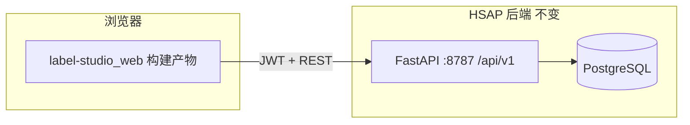

# 用 Label Studio 工程前端整体替换 HSAP UI

## 现状

| 已完成 | 说明 |
|--------|------|
| NX 应用 `apps/hsap-platform`（`@humansignal/ui` + tailwind） | 登录、侧栏、全模块页 |
| `libs/editor` 标注画布 | `/labeling/campaigns/:id/annotate` |
| 标注 REST API | bootstrap / tasks / media / annotations / export / ml |
| Catalog / 审核 / 训练 / Job / 车队 | 接 HSAP `/api/v1` |
| `yarn hsap:build` → `platform/ui-hsap/dist` | `build_hsap_ls_ui.sh` |
| 废弃 `build_web.sh` | 旧 Vite 仅应急回退 |

**结论：** 生产 UI 以 [`workspace/BK2/label-studio/web`](../../workspace/BK2/label-studio/web) 的 `hsap-platform` 为准；旧 `HSAP/platform/web` 已移除。

---

## 目标架构



- **前端：** `label-studio/web` → `yarn build` → 静态资源由 Nginx 或 FastAPI 挂载
- **后端：** 仍为 `HSAP/platform/as_platform`（标注 Campaign、pending、catalog、审核、训练）
- **不跑** Label Studio Django；仅复用其 **React 壳 + 组件库 + Editor**

---

## 实施步骤（按顺序）

### 1. 在 LS 工程中新增 HSAP 应用壳

路径建议：`label-studio/web/apps/hsap-platform/`（或 `apps/labelstudio/src/pages/Hsap/`）

- 复制/参考 `Menubar`、`SidebarMenu`、`RootPage` 布局
- **去掉** Heartex / Label Studio logo 与产品首页
- 侧栏导航映射 HSAP 路由：
  - 送标 / 标注任务 / 数据目录 / 审核 / 训练 / Job / 车队

### 2. API 适配层（关键）

LS 默认 `ApiProvider` 指向 Django `/api/projects` 等。

新建 **`HsapApiProvider`**（或扩展 `ApiConfig`）：

- `gateway`: `http://127.0.0.1:8787/api/v1`（开发）/ 同源 `/api/v1`（生产）
- HSAP 页面继续调用现有接口：`pending`、`catalog`、`labeling/batches`、`approvals`…
- **不**实现 LS 的 projects/users 全量端点（删减模块）

### 3. 页面迁移顺序

| 优先级 | 页面 | LS 组件 |
|--------|------|---------|
| P0 | 登录 | `@humansignal/ui` Card/Button |
| P0 | 壳 + 标注任务列表 | Menubar + Table |
| P1 | 送标工作台 | 同上 |
| P1 | 标注画布 | `libs/editor` + HSAP labeling API |
| P2 | 数据目录 / 审核 | DataManager 风格表格（可选轻量自写） |
| P2 | Export | 参考 LS Settings 布局，接 HSAP API |
| P3 | 训练 / Job / 车队 | 逐步迁 |

### 4. 构建与 Docker

**推荐（宿主机无 Node 时也可用）：**

```bash
cd HSAP
bash scripts/build_hsap_ls_ui.sh
```

脚本在 Docker `node:22-alpine` 内挂载 **整个** `label-studio` 仓库（NX 需要根目录 `pyproject.toml`），执行 `yarn hsap:build`，输出到 `platform/ui-hsap/dist`。

**手动：**

```bash
cd workspace/BK2/label-studio/web
yarn install
yarn hsap:build
cp -a dist/apps/hsap-platform/. ../../HSAP/platform/ui-hsap/dist/
```

`HSAP/Dockerfile`：

- 不再在镜像内构建 `platform/web`
- 构建前需已有 `platform/ui-hsap/dist`（由上述脚本生成）
- FastAPI `_mount_ui()` 仅挂载 `ui-hsap/dist`（须先执行 `build_hsap_ls_ui.sh`）

### 5. 废弃清单（已完成）

- 已删除 `HSAP/platform/web` 源码与 `docker-compose` 的 `web-dev` 服务
- 仅保留 `platform/ui-hsap/dist` 为 Web 静态资源

---

## 与标注闭环的关系

- **任务键** 仍为 `project + task + mode + batch`（见 `labeling.registry.yaml`）
- **Editor** 在 LS 壳内路由 `/labeling/.../annotate`
- **ML / Export** 在 LS 风格设置页，逻辑走 HSAP worker

---

## 本地开发

**A. HSAP 一体（:8787）**

```bash
bash HSAP/scripts/build_hsap_ls_ui.sh
cd HSAP && docker compose up -d --build platform
# 浏览器 http://127.0.0.1:8787  强刷缓存
```

**B. 前端 HMR（:8015）**

```bash
cd HSAP && docker compose up -d postgres redis platform
cd workspace/BK2/label-studio/web
yarn hsap:dev
# http://127.0.0.1:8015 ，/api 代理到 8787
```

---

## 样式说明（若页面像「纯 HTML」）

构建产物里 **有** CSS/JS（约 `main.css` 200KB、`main.js` 700KB）。若侧栏挤在左边、无间距/配色，通常是：

1. **设计 token 未打进包** — 需在 `main.tsx` 引入 `@humansignal/ui/src/styles.prefix.css`（与 `tailwind.css` 一起）
2. **Tailwind 未进 `main.css`** — HSAP 生产构建需把 tailwind 抽到 `main.css`（见 `webpack.config.js` `standalone-hsap`）
3. **`index.html` 误用 `type="module"`** — `build_hsap_ls_ui.sh` 会改回普通 `<script src="main.js">`

浏览器 **强刷** 后应看到 LS 浅色主题与圆角卡片。

---

## 浏览器验收清单

1. 登录 `http://127.0.0.1:8787`（或 HMR `:8015`）
2. **标注任务** 可见 registry 批次（如 `dam/batch_0516`）
3. 进入画布：加载 `dam_15cls.xml`；有 inbox 图片时可框选保存
4. **导出** 后在 **Jobs** 页看到 `labeling_export`
5. **审核** 列表 → 详情 → 缩略图 lightbox；可提交审核动作
6. **车队** 地图瓦片 + 车辆 CRUD + 行程轨迹
7. **训练** 发起记录、查看详情与 registry
8. **数据目录** DMS scope + 类别分布条形图

```bash
bash HSAP/scripts/smoke_platform_api.sh   # labeling + fleet + health
```

详见 [BROWSER_QA_CHECKLIST.md](BROWSER_QA_CHECKLIST.md)。

### 车队地图环境变量

| 变量 | 说明 |
|------|------|
| `AS_FLEET_MAP_ENABLED=1` | 启用车队 API |
| `AS_MAP_TILE_PROVIDER` | `gaode`（默认）或 `osm` |
| `AS_AMAP_KEY` | 高德 Web 服务 Key（可选；无 key 时 UI 会尝试公开瓦片，失败自动切 OSM） |

## 角色与权限（阶段五）

| 角色 code | 用途 |
|-----------|------|
| `internal_labeler` | 内部标注：`read:pending`、`read:jobs` |
| `labeler` | 送标登记：`write:approval_submit:register` |
| `reviewer` | 审核：`write:approval_review` |
| `engineer` | 全功能（含 `*` 或训练提交） |

开发环境 `dev/login` 用户通常带 `*`；生产请在用户管理分配角色。

## 后续增强（可选）

1. 审核 overlay 细化（多边形/关键点样式）
2. 标注锁多实例 Redis 一致性
3. 更大路线图见 `label_studio_hsap` plan（AnnotationRevision PG 等）

## 新增路由（Plan 汇总里程碑）

| 路由 | 说明 |
|------|------|
| `/labeling/export` | 导出与入库 |
| `POST .../import-vendor` | 第三方 ZIP 回传 |
| `GET /api/v1/fleet/stream` | SSE（Redis） |
| `POST /api/v1/tbox/gps/batch` | 批量 GPS |
| `POST .../import-csv` | CSV 轨迹补录 |

验收与差距见 [QA_GAP_REPORT.md](QA_GAP_REPORT.md)、[DATA_LAKE_GAP.md](DATA_LAKE_GAP.md)。
