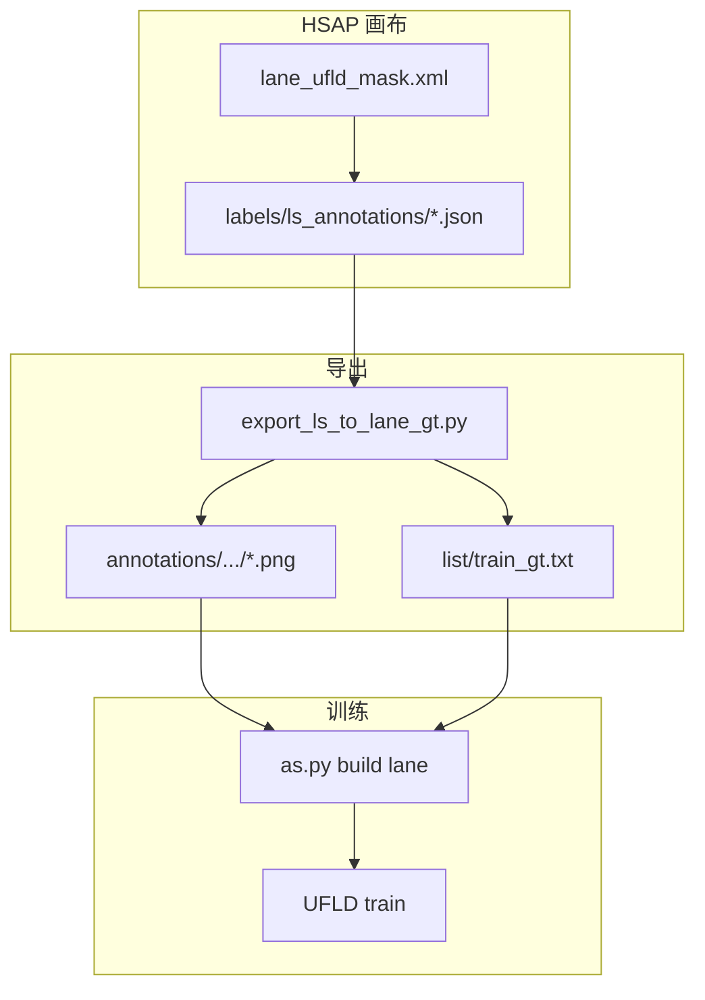

# HSAP 车道线标注接入计划

本文说明如何在 HSAP 平台接入车道线标注，与 DMS 检测/pose **共存**。对齐 [`workspace/lane/DATASET`](../../workspace/lane/DATASET) 的 UFLD 训练规范。配套总路线图见 [DEVELOPMENT_ROADMAP.md](./DEVELOPMENT_ROADMAP.md) 阶段 D。

---

## 1. 目标与边界

**目标**：HSAP 画布标注车道线 → 导出 **PNG 分割 mask + `list/train_gt.txt`** → `as.py build lane` → UFLD 训练。

**不做（本期）**：CULane `.lines.txt` 折线画布（archive 历史格式保留，二期可选）。

| Profile | 编辑器 | 导出 | 现状 |
|---------|--------|------|------|
| DMS | `dms_detect.xml` / `dms_pose.xml` | `yolo` / `yolo_pose` | 已实现 |
| **lane_v1** | **`lane_culane.xml`（缺失）** | **`lane_gt_txt`** | registry 占位 |

**命名**：registry 中 `lane_culane.xml` 为历史名；实现文件建议 `lane_ufld_mask.xml`（内容为 **BrushLabels**），并在 registry 更新。



---

## 2. 你们现有的 Lane 数据规范（背景）

实体数据：[`workspace/lane/`](../../workspace/lane/)（[`workspace/Lane/dataset`](../../workspace/Lane/dataset) 为软链入口）。

**训练标准格式**（UFLD）：

```text
DATASET/
├── images/<src_...>/frame_xxxxx.jpg
├── annotations/<src_...>/frame_xxxxx.png    # 单通道 mask，像素值=车道 ID
└── list/train_gt.txt                          # 两列：图路径 + mask 路径
```

`train_gt.txt` 示例：

```text
images/src_culane/.../frame_004140.jpg annotations/src_culane/.../frame_004140.png
```

**像素编码**（见 [`vis_random_sample.py`](../../workspace/lane/scripts/vis_random_sample.py)）：

| 像素值 | 含义 |
|--------|------|
| 0 | 背景 |
| 2～6 | 各条车道线 |

archive 里另有 JSON 折线、`.lines.txt`（CULane），由 [`build_ufld_dataset.py`](../../workspace/lane/scripts/build_ufld_dataset.py) 转成 mask 包；**平台标注应直接产出 mask**，不再绕折线。

---

## 3. 阶段一：编辑器模板（画布层）

### 3.1 新增 XML

路径：`HSAP/datasets/lane/configs/label_studio/lane_ufld_mask.xml`

```xml
<View>
  <Image name="image" value="$image" zoom="true"/>
  <BrushLabels name="lanes" toName="image" strokeWidth="3">
    <Label value="lane_1" background="#00FF00"/>
    <Label value="lane_2" background="#0080FF"/>
    <Label value="lane_3" background="#FF0000"/>
    <Label value="lane_4" background="#FF00FF"/>
    <Label value="lane_5" background="#00FFFF"/>
  </BrushLabels>
</View>
```

标注员操作：选 lane 标签 → 画笔沿车道线涂抹（与离线 LabelMe/CVAT 涂 mask 一致）。

### 3.2 像素 manifest

路径：`HSAP/datasets/lane/configs/lane_mask_encoding.yaml`

```yaml
background: 0
lanes:
  - {label: lane_1, pixel: 2}
  - {label: lane_2, pixel: 3}
  - {label: lane_3, pixel: 4}
  - {label: lane_4, pixel: 5}
  - {label: lane_5, pixel: 6}
```

### 3.3 修复模板路径

[`annotate.py`](../platform/as_platform/labeling/annotate.py) 当前 `LABEL_CONFIG_DIR` 仅指向 DMS，Lane 读不到模板：

- `dms` → `datasets/dms/configs/label_studio/`
- `lane` → `datasets/lane/configs/label_studio/`

更新 [`labeling.registry.yaml`](../datasets/labeling.registry.yaml)：

```yaml
lane__lane_v1:
  editor_template: lane_ufld_mask.xml
  export_default: lane_gt_txt
```

无需改 Label Studio 前端源码（Brush 为 Editor 内置）。

---

## 4. 阶段二：格式转换（核心）

新增：`HSAP/datasets/lane/scripts/export_ls_to_lane_gt.py`

### 4.1 输入

`labels/ls_annotations/<task_id>.json`，`result[]` 中 `type: "brushlabels"`（RLE / polygon）。

### 4.2 输出

| 产物 | 规则 |
|------|------|
| PNG mask | `annotations/<mirror_path>.png`，单通道 uint8 |
| list 行 | `list/train_gt.txt`：`images/...jpg annotations/...png` |
| 合并逻辑 | 多 brush region 按 label→pixel 合成一张 mask |

### 4.3 与 offline 流程共存

| 路径 | 说明 |
|------|------|
| **HSAP 画布** | ls_annotations → export → pack 内 images/annotations/list |
| **外协 archive** | 继续 `build_ufld_pack.py` 整包入库 |
| **训练** | 两路经 `merge_ufld_lists.py` 去重合并 |

---

## 5. 阶段三：Campaign 与导出 Job

### 5.1 批次目录

```text
datasets/lane/inbox/<batch>/
  images/...
  annotations/          # 导出生成
  list/train_gt.txt
  labels/ls_annotations/
```

或增量包 `DATASET-AddBy-<工程师>-<日期>/`（见 [`DATASETS_LAYOUT.md`](../../workspace/lane/DATASETS_LAYOUT.md)）。

### 5.2 runner

[`runner.py`](../platform/as_platform/jobs/runner.py) 增加：

```text
export_default == lane_gt_txt
  → export_ls_to_lane_gt(batch_dir)
  → as.py build lane
```

与 DMS `yolo` / `yolo_pose` **分支共存**。

### 5.3 batch_stage

扩展 [`batch_stage.py`](../platform/as_platform/labeling/batch_stage.py)：`list/train_gt.txt` 非空且 PNG 存在 → `stage=returned`。

---

## 6. 阶段四：验证与文档

| 项 | 动作 |
|----|------|
| 单元测试 | `test_export_ls_to_lane_gt.py` |
| 可视化 | `workspace/lane/scripts/vis_random_sample.py` 叠加 |
| smoke | 扩展 `smoke_labeling_api.sh` lane 分支 |
| 文档 | LABELING_SOP §4.4、PHASE_ROLLOUT P2、BROWSER_QA_CHECKLIST |

---

## 7. 风险与对策

| # | 风险 | 对策 |
|---|------|------|
| 1 | Lane 模板读 DMS 目录 | annotate 按 project 分目录 |
| 2 | Brush RLE 解码失败 | 单测 + 参考 LS RLE 解码 |
| 3 | 像素值与历史 pack 不一致 | manifest 固定；导出后 scan unique values |
| 4 | 多线 overlap | 按 lane 顺序合并；SOP 约定尽量不交叉涂 |
| 5 | 线宽不一致 | strokeWidth=3，文档约定 |
| 6 | list 路径错误 | 相对 pack 根；build 用 `--prefix-from-pack` |
| 7 | 折线 vs mask 混淆 | SOP：UFLD 只认 mask |
| 8 | workspace/lane 软链 | `setup_links.sh` 保持 datasets/lane → workspace/lane |

---

## 8. 排期建议

| 阶段 | 时间 | 内容 |
|------|------|------|
| 一 | 3～5 天 | XML + encoding + annotate 路径 |
| 二 | 5～7 天 | export 脚本 + 单测 |
| 三 | 2～3 天 | runner + inbox 试点 |
| 四 | 2 天 | 文档 + 浏览器验收 |

**建议**：DMS 阶段 A（[PHASE_ROLLOUT_DMS.md](./PHASE_ROLLOUT_DMS.md)）基本通过后再启动 Lane，避免 E2E 并行分散。

---

## 9. 验收标准

- [ ] Lane Campaign 画布：Brush 五车道工具
- [ ] 保存 JSON 含 `brushlabels`
- [ ] 导出 PNG 像素值符合 manifest
- [ ] `list/train_gt.txt` 两列正确
- [ ] `as.py build lane` 成功
- [ ] `vis_random_sample.py` 叠加正确
- [ ] 与 DMS Campaign 可同时存在

---

## 10. 关键文件清单

| 操作 | 路径 |
|------|------|
| 新增 | `datasets/lane/configs/label_studio/lane_ufld_mask.xml` |
| 新增 | `datasets/lane/configs/lane_mask_encoding.yaml` |
| 新增 | `datasets/lane/scripts/export_ls_to_lane_gt.py` |
| 新增 | `datasets/lane/scripts/test_export_ls_to_lane_gt.py` |
| 修改 | `platform/as_platform/labeling/annotate.py` |
| 修改 | `datasets/labeling.registry.yaml` |
| 修改 | `platform/as_platform/jobs/runner.py` |
| 修改 | `platform/as_platform/labeling/batch_stage.py` |

---

*版本：2026-05-27 · 对齐 workspace/lane UFLD mask 规范*
